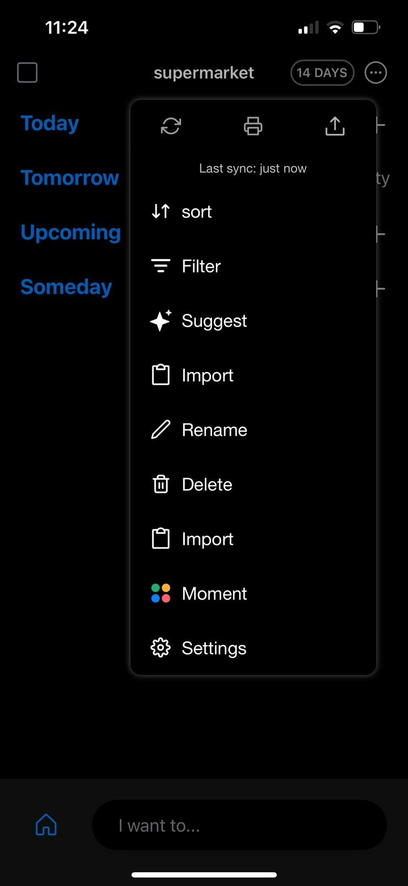

# Description of the application on the app store(IOS) :

### I considered this desription as a list of requirements to create the test scenarios.

Join over 40 million people who rely on Any.do to organize their life, work and get more done. "IT'S A MUST HAVE APP" (NYTimes, WSJ, USA Today & Lifehacker). It's the perfect combo of a task list, calendar, planner & reminders all-in-one app.

THE #1 TO DO LIST & TASK LIST
### SYNCS SEAMLESSLY 
between your mobile, desktop, web, and tablet. Keeps all your to do list, tasks, reminders, calendar & agenda always in sync so you’ll never forget a thing
 
### GET REMINDERS 
for a scheduled time, when you reach a particular location or set recurring reminders so you never miss a thing

### WORK TOGETHER 
with shared lists and assigned tasks to collaborate and get more done, with anyone.
Widget with simple and powerful features to keep your to do list and calendar events always at hand

### SIMPLE & POWERFUL CALENDAR OUTLOOK
EASILY VIEW your events and to-do list & Tasks for the day, week & month
### SYNC SEAMLESSLY in real-time 
with your phone’s calendar, google calendar, Facebook events, outlook calendar, or any other calendar so you don’t forget an important event

ALL-IN-ONE APP FOR GETTING THINGS DONE
### To easily create reminders we added voice entry 
so you can just speak your mind and we’ll add it to your to do list. 
### For better task management flow we added a calendar integration
to keep your agenda always up to date. 
### To enhance your productivity we added cross-platform support 
for recurring reminders, location reminders, sub-tasks, notes & file attachments. 
### To keep your to-do list always up to date, 
we’ve added a one-of-a-kind daily planner.

### TO DO LIST, CALENDAR & REMINDERS MADE SIMPLE
Any.do was designed to keep you on top of your to do list and calendar with no hassle. Thanks to the intuitive drag and drop of tasks, swiping to mark to-do's as complete, and shaking your device to remove completed from your to do list - you can keep yourself organized and enjoy every minute of it.

### POWERFUL TASK LIST MANAGEMENT
Looking for more? Add a to do list item straight from your email inbox by forwarding do@any.do. Attach files from your computer, Dropbox, or Google Drive to your tasks.

### LIFE ORGANIZER & DAILY PLANNER
Any.do is a to do list, a calendar, an inbox, a notepad, a checklist, task list, a board for post its or sticky notes, a project management tool, a reminders app, a daily planner, a family organizer, and overall the simplest and most useful productivity tool you will ever have.

### SHARE LISTS & ASSIGN TASKS
To plan & organize projects has never been easier. Now you can share lists between family members, assign tasks to each other, chat and much more. Any.do will help you and the people around you stay in-sync and get reminders so that you can focus on what really matters, knowing you had a productive day and crossed off your to do list

### GROCERY LIST & SHOPPING LIST
Any.do task list is also great for shopping at the grocery store. Right there on your to do list is a handy shopping list option that you can share with others. Forgot to buy post-it notes? Want reminders? Simply create a list on Any.do, share it with your loved ones and see them adding their shopping items in real-time. You won’t believe how you’ve done shopping or grocery lists before

# First Part: Test Design
## Testing Scenarios :

* When setting up a reminder for a scheduled time, You will receive a notification at the specified time titeled with the name of the reminder and the time : **Priority num 1**
* When trying to set up a reminder for a time in the past (It is 12:15 pm and you want to set a reminder for today at 11:30 am), The application won't allow it. **Priority num 2**
* When you share your to do list or grocery list with your team, You can all see the updates and edits added to the list. You can also edit yourself. **Priority num 6**
* Verify that you can use voice commands to add tasks and reminders to your to-list using siri. **Priority num 10**
* Verify that you can easily add attachements and files to your tasks. **Priority num 9**
*  Mark a task as completed and shake your device. The completed task should be removed from your to do list. **Priority num 5**
*  Set up a task in your to do list for Today. If you drag and drop it to to tomorrow's list it should be moved. **Priority num 8**
*  When you swipe , or click on the checkbox next to the task, it is marked as complete. **Priority num 3**
*  You can tag a task as a priority and it will be at the top of the list. **Priority num 4**
*  You can filter the tasks in a list using tags like "Priority". You should only see the tagged tasks in your list. **Priority num 7**

  # Second Part: Bug Reporting

  ## Bugs found :
  Title : title of the bug  
  Reproducible Steps : steps needed to reproduce the bug  
  Attachments : pictures of the bug   
  Affected Devices : the devices or platforms where the bug has been observed or is expected to occur.  
  Network: Indicates the types of networks where the issue occurs (Wi-Fi, cellular data, etc.).  
  Severity: Represents the degree of impact or seriousness of the bug.  
  Priority: Indicates the urgency or importance of fixing the bug. 
  Impact: Describes how the bug affects user experience or functionality. 

  * Bug 1:  
     - Title :Repeated Feature 
     - Reproducible Steps :  
    1.Click on any list of your choice  
    2.Click on the three little dots at the top right of the screen  
    3.You will see 2 "import" labels that do the same funtionality 
    - Attachements :  
      
    - Affected Devices : Iphone  
    - Network : 4G and Wifi  
    - Severity : 3 out of 5 (5 being the highest and 1 being the lowest)  
    - Priority : 2 out of 5 (5 being the highest and 1 being the lowest)  
    - Impact : 1 out of 5 (5 being the highest and 1 being the lowest)  

   * Bug 2 :  
     - Title :Same purpose different name 
     - Reproducible Steps :  
    1.Click on any list of your choice  
    2.Click on the three little dots at the top right of the screen  
    3.Click on settings  
    4.If you click on "Speech" or "Language" you will be guided to the same list of languages
    - Attachements :  
      
      
      
      
    - Affected Devices : Iphone  
    - Network : 4G and Wifi  
    - Severity : 3 out of 5 (5 being the highest and 1 being the lowest)  
    - Priority : 2 out of 5 (5 being the highest and 1 being the lowest)  
    - Impact : 1 out of 5 (5 being the highest and 1 being the lowest)  
    
    

    
    

